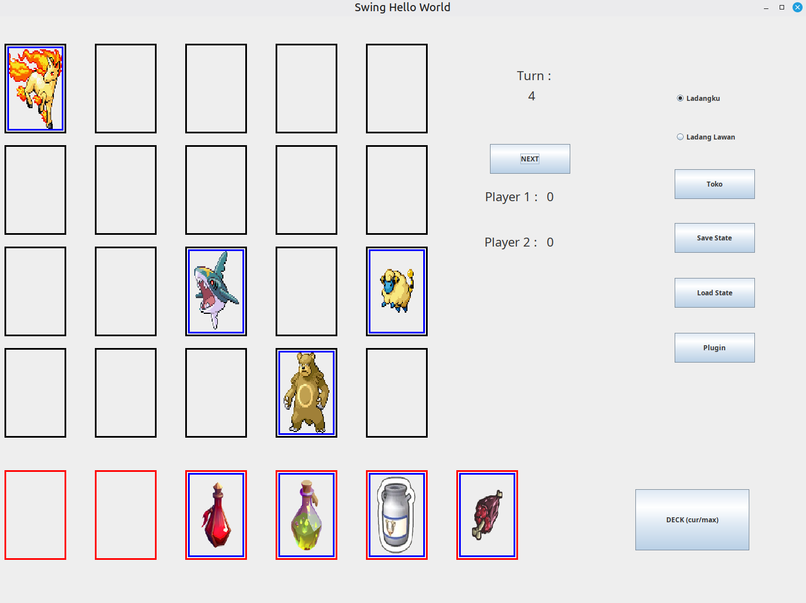
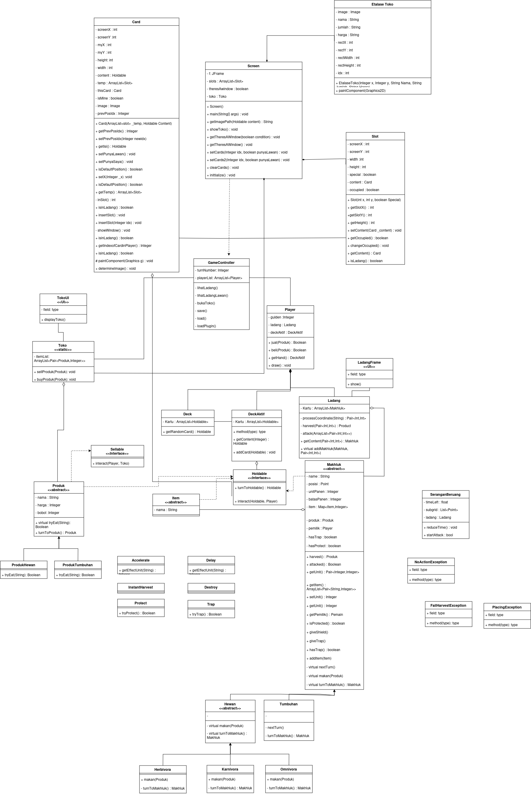

# P98_OOP_Makin_Berkelas

Tugas Besar 2 IF2210 Pemrograman Berorientasi Objek

## Deskripsi Program

Program game farming simulator yang ditulis dengan bahasa Java. Game terdiri atas Deck, Deck Aktif, Ladang dan Toko, serta kartu-kartu yang dapat dikelola Pemain. Pemain harus menggunakan kartu dan mengelola kartu di dalam Deck, Deck Aktif, dan Ladang, serta menjual produk di Toko untuk mendapatkan Gulden sebanyak mungkin sebelum permainan selesai. Ketika telah lewat 20 turn, game akan berakhir dan pemain dengan Gulden terbanyak akan menjadi pemenang. 

Digunakan konsep - konsep OOP seperti Inheritence , Polymorphism, Method/Operator Overloading, Generic Class dan Abstract Base Class. Menggunakan Prinsip SOLID dan Design Pattern seperti Mediator, Composite, dan Singleton.

## Anggota

| No  | Nama                        | NIM      |
| --- | --------------------------- | -------- |
| 1   | Ariel Hefrison              | 13522002 |
| 2   | Irfan Sidiq Permana         | 13522007 |
| 3   | Bryan Cornelius Lauwrence   | 13522033 |
| 4   | Ahmad Hasan Albana          | 13522041 |
| 5   | Venantius Sean Ardi Nugroho | 13522078 |

## Setup dan Instalasi

dengan asumsi menggunakan linux atau wsl

1. Clone repo
   ```
   https://github.com/Ariel-HS/P98_OOP_Makin_Berkelas
   ```

2. Pindah ke repo tersebut dalam terminal
   ```
   cd P98_OOP_Makin_Berkelas
   ```

3. Lakukan pembersihan pada target
   ```
   mvn clean
   ```

4. Compile programnya
   ```
   mvn package
   ```

5. Jalankan programnya
   ```
   java -jar target/P98_OOP_Makin_Berkelas-1.0-SNAPSHOT.jar
   ```

## Screenshots


## Class Diagram

